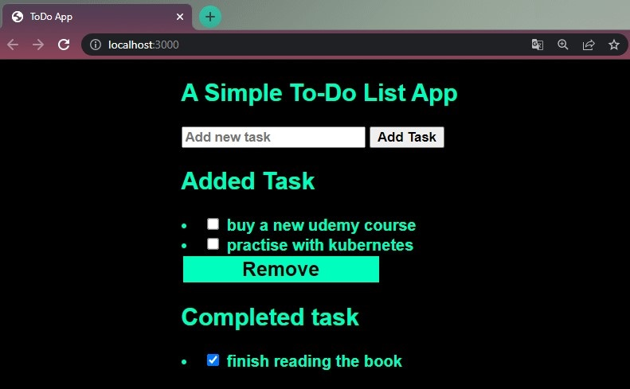
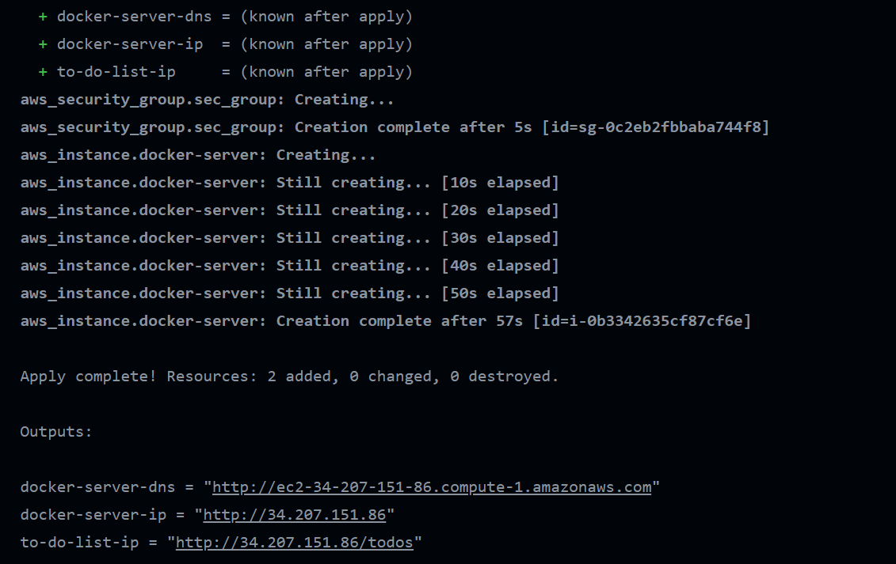
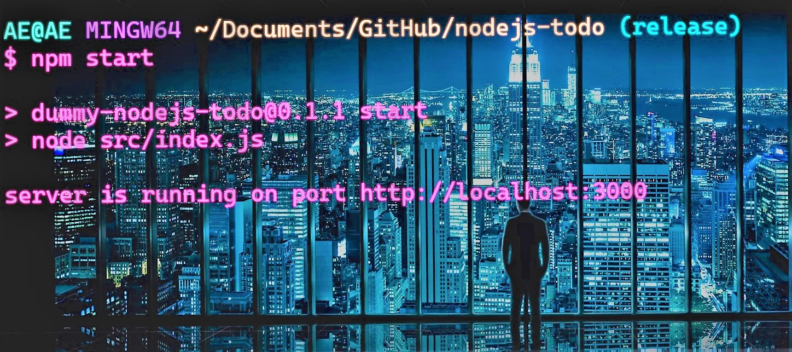
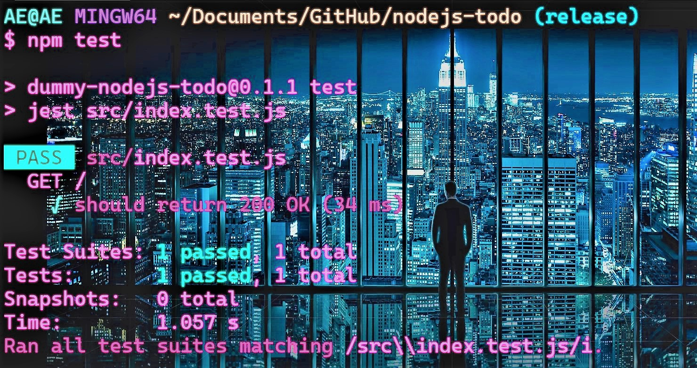

[](https://github.com/devenes/node-js-dummy-test/actions/workflows/node.js.yml) [](https://github.com/devenes/node-js-dummy-test/actions/workflows/dockerx.yml) [](https://github.com/devenes/node-js-dummy-test/actions/workflows/node.js.scan.yml)  

# To Do Web App served with Node.js and Express.js

## Description

Simple To Do application built with Node.js and Express.js that lets you add tasks on a single page, store new and finished tasks in different arrays. Containerized with Docker and tested with NPM through GitHub Actions pipeline.

## Embedded Javascript

EJS simply stands for Embedded Javascript. It is a simple templating language/engine that lets its user generate HTML with plain javascript. EJS is mostly useful whenever you have to output HTML with a lot of javascript. EJS is a simple templating language that lets you generate HTML markup with plain JavaScript. No religiousness about how to organize things. No reinvention of iteration and control-flow.

## Body-Parser

Body-Parser is the Node. js body parsing middleware. It is responsible for parsing the incoming request bodies in a middleware before you handle it. This extracts the entire body portion of an incoming request stream and exposes it on req.body

## Output



## Terraform Output



## Run App locally

<li> Run <code> npm install </code> to install all needed dependencies </li>

<li> Then start the server using <code>npm start</code> </li>

<li> Navigate to your browser <code> http://localhost:3000/ </code> to view the app </li>



## Test App

Run <code> npm test </code> to run the tests



## Build Docker Image with Dockerfile

Use the following commands in your `Dockerfile` to build a Docker image:

```dockerfile
FROM node:16-alpine
WORKDIR /app
COPY package*.json ./
RUN npm install
COPY . .
EXPOSE 3000
CMD ["npm", "start"]
```

- Note: Set your copy directory with `./` in `Dockerfile`. Not just with `.`

- This is because the Docker Compose sometimes give you a warning about the `.` directory

## Containerization with Docker using GitHub Actions

Create your own GitHub Actions workflow to build your Docker image and push it to DockerHub. Name your workflow file as <code> dockerx.yml </code> and add the following steps:

```yml
name: Docker Deployment

on:
  push:
    branches:
      - "release"

  pull_request:
    branches:
      - "release"

jobs:
  dockerx:
    runs-on: ubuntu-latest
    steps:
      - name: Set up QEMU
        uses: docker/setup-qemu-action@v1

      - name: Set up Docker Buildx
        uses: docker/setup-buildx-action@v1

      - name: Login to DockerHub
        uses: docker/login-action@v1
        with:
          username: ${{ secrets.DOCKERHUB_USERNAME }}
          password: ${{ secrets.DOCKERHUB_PASSWORD }}

      - name: Build and push
        uses: docker/build-push-action@v2
        with:
          push: true
          tags: ${{ secrets.DOCKERHUB_USERNAME }}/todo-nodejs-vx:${{github.run_number}}
```

## Test Your Code with GitHub Actions

Create your own GitHub Actions workflow to test your code. Name your workflow file as <code> node.js.yml </code> and add the following steps:

```yml
name: Node.js CI Test

on:
  push:
    branches:
      - "*"

  pull_request:
    branches:
      - "*"

jobs:
  build:
    runs-on: ubuntu-latest

    strategy:
      matrix:
        node-version: [12.x, 14.x, 16.x]

    steps:
      - uses: actions/checkout@v3

      - name: Use Node.js ${{ matrix.node-version }}
        uses: actions/setup-node@v3
        with:
          node-version: ${{ matrix.node-version }}
          cache: "npm"

      - run: npm ci

      - run: npm run build --if-present

      - run: npm test
```

## Resources

[Using workflow run logs](https://docs.github.com/en/actions/monitoring-and-troubleshooting-workflows/using-workflow-run-logs)

[Understanding GitHub Actions](https://docs.github.com/en/actions/learn-github-actions/understanding-github-actions)

[Node.js](https://www.yusufsezer.com.tr/node-js-npm/)

[Todo App with Node.js](https://medium.com/@atingenkay/creating-a-todo-app-with-node-js-express-8fa51f39b16f)

[npm-run-script](https://docs.npmjs.com/cli/v8/commands/npm-run-script)

[npm-test](https://docs.npmjs.com/cli/v8/commands/npm-test)

[npm](https://www.npmjs.com/)
